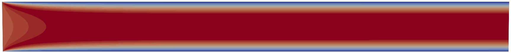

<p align="center">  </p>

# <p align="center"> Channel Flow Simulations </p>

This repository contains a lab notebook to demonstrate effects of a modified pressure outflow boundary condition on a simple channel flow simulation using a containerized simlulation built using Flash-X (https://flash-x.org), a multiphysics simulation software instrument.

## Dependencies

Running Flash-X in a containerized environment requires that Message Passing Interface (MPI) library is installed and available for use on platforms where users wish to run their simulations. Path to location of the library should be defined in ``environment.sh`` located in the project root directory.

Organization of computational experiments is implemented using Jobrunner, which enables reuse of files/scripts along directory trees and ensures strict organization rules. Details on Jobrunner are provided separately in its own repository (https://github.com/akashdhruv/Jobrunner), and can be installed by running,

```
pip install PyJobRunner
```

`pip` should point to `python3+` package installer `pip3`

Deployment of containers is done using Maple (https://github.com/akashdhruv/Maple), which can be installed using,

```
pip install PyMaple
```

For visualization we rely on ParaView (https://www.paraview.org), and assume that it has already been installed on the platform by admins/users of this lab notebook. FlashKit (https://github.com/GWU-CFD/FlashKit) can be used to generate ParaView compatible files from HDF5 data generated by Flash-X. FlashKit  provides a slew of tools to work with Flash-X, however, we only rely on the command ``flashkit create xdmf`` to generate XDMF hyperslabs.

To perform analysis of simulations results, and integrate them with python packages for machine learning and statistics we use BoxKit (https://github.com/akashdhruv/BoxKit), which is an ongoing project to parallelize and scale data analysis of block-structured datasets. BoxKit can be installed using the ``python3+`` package manager,

```
pip install BoxKit
```

## Organization

```
$ tree Channel-Flow

├── Jobfile
├── environment.sh
├── simulation
    ├── Jobfile
    ├── flash.par
    ├── Maplefile
    ├── neumann
    ├── outflowf
        ├── buffer01
        ├── buffer10
        ├── buffer15
        ├── buffer20
├── analysis
    ├── Jobfile
    ├── requirements.txt
    ├── Maplefile
```

## Usage

Once a user has installed necessary libaries/tools, i.e., Jobrunner, Maple, MPI, and ParaView, and designed their customized `environment.sh`, they can setup simulation by running the following command from the project root directory,

```
jobrunner setup simulation
```

This command will build a `channel_flow.sif` singularity image which can be run by executing,

```
jobrunner submit simulation/neumann
jobrunner submit simulation/outflow/buffer01
jobrunner submit simulation/outflow/buffer*
```

Make sure to edit Jobfiles as desired to change/update your schedular configuration.

TIP: use `--show` with `jobrunner setup` and `jobrunner submit` to see the parsed configuration for a working directory derived from Jobfiles along the directory tree.

To visualize data using ParaView run following from the working directory of a job run,

```
flashkit create xdmf -b <begin_number> -e <end_number>
```

The `<begin_number>` and `<end_number>` refer to the files containing the pattern `*_hdf5_plt_cnt_*`. The resulting `*.xmf` file is ParaView compatible.

